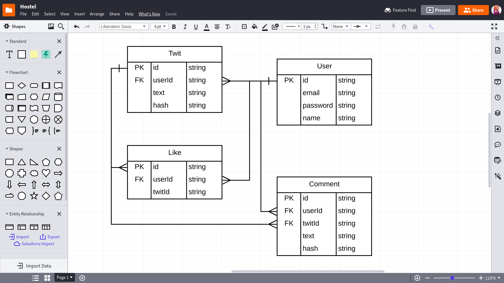

# Twitee API

This the backend API for the twitee application. Twitee is a mini and substandard runoff of Twitter

## Features

- XSS Protection (via [sanitize-html](https://www.npmjs.com/package/sanitize-html))

## Running Locally

#### Start the server

To run in production mode where code is transpiled by Babel into a `dist` folder and run directly in `node`:

> a mongo db instance must be runing and listening on port(27017)

```bash
yarn i
yarn start
```

### Run with docker

You can also run the server with docker. It buil build and run the application image

> this will automatically start up a mongoDB instance listening on port (27017)

```bash
docker-compose up
```

#### Prerequisites

- [Node JS](https://nodejs.org/en/)
- [Mongo DB](https://www.mongodb.com)

To run in development mode where code is run by [babel-node](https://babeljs.io/docs/en/babel-node) via [nodemon](https://nodemon.io) and re-transpiled any time there is a change:

> I used [babel-node](https://babeljs.io/docs/en/babel-node) soo i can utilize ES6 feature like import and export

```bash
yarn dev
```

### Test

#### run unit test

> install the mongodb-memory-server => the first time the test run will require internet connection, but subsequent run will not require internet connectivity

```bash
yarn test
```

#### run end to end test

```bash
yarn test:e2e
```

### DETAILED DESIGN

1. Each user should have an account detail containing their name, email, password and date_created
1. Your app should have just 3 routes: login route, register route, post/posts route
1. Every authenticated user can comment or like every post that is posted.
1. Only the user that owns a post can delete that particular post.
1. Users can log out and get redirected to the login route
1. Unauthenticated users cannot interface with the app.

### Feature list for Twitee

1. User registration and authentication
1. User Log in
1. User POST twit
1. User DELETE twit (if owned by user)
1. User POST comments under twits
1. Post page shows all posted twits and comments under twits (Each twit will show the name of the poster, the date posted, the time posted, the posted content, like button and a comment form)
1. User log out

<!-- ================================================ -->

### The directory Structure

**test** ==> this directory contains the test helper functions and end to end test
**db** ==> this helps configure the database => creates index on all the collection
**src** ==> this contains the application code
**controller** ==> the controller directory contains all the controller functions
**data-access** ==> this contain the data base interface => that is responsible for accessing the database collection
**entities** ==> this is business entities of the application => **i deliberate left out the createOn and modifiedOn fields**CleanArchitecture


1. user
1. twit
1. like
1. comment

**express-callback** ==> this is responsible for creating express callback router function that can be used in the routers

**controller** ==> **express-callback** ==> **router-callback**

**middlesware** ==> this contains the authentication middle ware

**modules** ==> this contains helper functions user in different modules in the application

**router** ==> this contains the routers

**service** ==> this contains service functions that uses the database-interface to comunnicate with the database
**service/user** ==> this contains user authentication functions
**service/twit** ==> this contains twit related service functions

## Solution description

I used Clean Architecture for Microservice APIs in Node.js with MongoDB and Express
this


The coding Structure i adopted here produce systems that are:

1. Independent of Frameworks. The architecture does not depend on the existence of some library of feature laden software. This allows me to use such frameworks as tools, rather than having to cram the system into their limited constraints. I can easly change the Framework used as the system requirement dictates with little or no effort
1. Testable. The business rules can be tested without the UI, Database, Web Server, or any other external element. My Solution is very testable and it allowes unit and integration testing as i have demostrated in my codes.
1. Independent of UI. The UI can change easily, without changing the rest of the system. A Web UI could be replaced with a console UI, for example, without changing the business rules of the application.
1. Independent of Database. I can swap out the MongoDB for a different Database(like a SQL db such as PostgresSQL), BigTable, CouchDB, or something else, With having the changes the underline business entities of logic. The business rules are not bound to the database That I used.
1. Independent of any external agency. The business rules simply don’t know anything at all about the outside world. Which makes my solution(code structure) a good fit as it is very scalables
